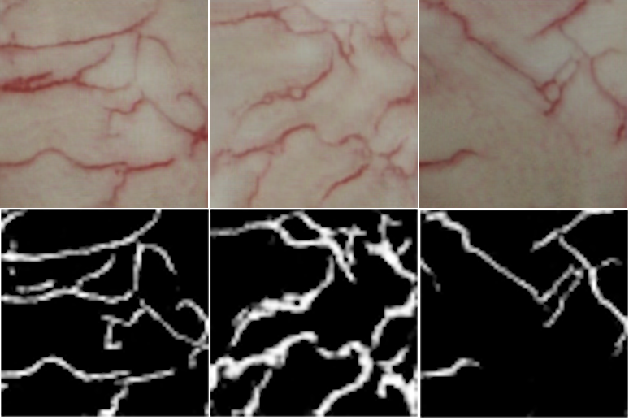

# Сегментация капилляров глаза человека по снимкам с офтальмологической щелевой лампы

## Обучение

Эксперименты проводились на основе следующих решений:
* [RVGAN](https://github.com/SharifAmit/RVGAN "GitHub")
* [SGL-Retinal-Vessel-Segmentation](https://github.com/SHI-Labs/SGL-Retinal-Vessel-Segmentation "GitHub")
* [SA-UNet](https://github.com/clguo/SA-UNet "GitHub")

Также был разработан собственный пайплайн для обучения моделей из [SMP](https://github.com/qubvel/segmentation_models.pytorch "GitHub").\
Код расположен в директории: `./training/SegmentationTrainingTiling/`

Наилучшие результаты на тестовой выборке (загрузка на сайт) продемонстрировала собственная реализация с идеями, взятыми из репозитория:
* [MedISeg](https://github.com/hust-linyi/MedISeg "GitHub")

Лучшая конфигурация из [SMP](https://github.com/qubvel/segmentation_models.pytorch "GitHub"): 
- Encoder: EfficientNetV2s
- Decoder: MAnet

А именно помогли:
* Использование `CosineAnnealingLR`
* Использование для аугментаций (изначально казалось, что с ними будет только хуже):
  * CLAHE
  * RandomBrightnessContrast
  * RandomGamma
  * Предобучение модели на наборе данных [DRIVE](https://paperswithcode.com/dataset/drive "PapersWithCode")

В репозитории MedISeg было изменено:
* Загрузку данных переделал для генерации кропов из полного изображения
* Код инференс модели переделал под проход изображения окном с паресеченими
* Добавил постобработку результатов подели, а в частности фильтрация по контурам

Код расположеный по пути: `./training/MedISeg/` также поддерживает описанный ниже формат данных.

Дополнительно была обучена модель SGL-Retinal-Vessel-Segmentation, часто визуально демонстрирует результаты лучше, но
публичной тестовой метрике уступает предыдущему решению (имеет 0.48).
Веса для неё доступны по ссылке: [SGL weights](https://drive.google.com/uc?id=1SVLlx86RPRZ5yWO6DuICHhAalx0gWV3X "Google Drive")

### Запуск обучения

#### Конвертация данных
Для загрузки данных пользовался следующим форматом представления данных:
```shell
├── images
│   ├── IMG_1.png
│   ├── IMG_2.png
│   ├── ...
│   └── IMG_N.png
└── masks
    ├── IMG_1.png
    ├── IMG_2.png
    ├── ...
    └── IMG_N.png
```
Чтобы сконвертировать входной набор изображений с разметкой в `.geojson` формате, можно воспользоваться следующим скриптом:
`training/scripts/convert_dataset_to_masks.py`. Описание к нему:
```shell
usage: convert_dataset_to_masks.py [-h] [-i INPUT] [-o OUTPUT]

Convert dataset with geojson to image+mask format

optional arguments:
  -h, --help            show this help message and exit
  -i INPUT, --input INPUT
                        Path to input folder
  -o OUTPUT, --output OUTPUT
                        Path to output folder with images/ and masks/ folders
```
#### Фильтрация данных
Данные были разделены на тренировочную и валидационную выборку с соотношением `0.8` и `0.2` соответственно.\
Затем вручную выбрал изображения, содержащие наибольшее количество размеченных сосудов.
Профильтрованный набор данных можно скачать по [следующей ссылке](https://disk.yandex.ru/d/cac9w9lM2z3lKA "Yandex Disk")


#### Запуск обучение кастомного пайалйна обучения
Реализованный мной код для обучения находятся в директории: `./training/SegmentationTrainingTiling/`\
Чтобы запустить обучения на подготовленных данных сначала нужно настроить конфигурационный файл:
`./training/SegmentationTrainingTiling/train_config.yml`, а именно указать пути до тренировочных и валидационных данных.

### Обработка тестового набора данных моделью (получение сабмита)
Для этого необходимо скачать обученную модель по [ссылке](https://disk.yandex.ru/d/CCGEJNWI2C-xNg "Yandex Disk").\
Затем инференс происходит в два этапа (скрипты находятся в директории пайплайна для обучения):
1. Запуск инференса модели на изображениях для получения вероятностных масок
```shell
usage: make_submit_window_model.py [-h] [-i INPUT] [-o OUTPUT] [-m MODEL]

Make submit

optional arguments:
  -h, --help            show this help message and exit
  -i INPUT, --input INPUT
                        Path to test folder
  -o OUTPUT, --output OUTPUT
                        Path to submit folder
  -m MODEL, --model MODEL
                        Path to traced PyTorch model
```
2. Запустить шаг постобработки следующим скриптом:
```shell
usage: recompute_submit_with_threshold.py [-h] [-o OUTPUT]

Make submit

optional arguments:
  -h, --help            show this help message and exit
  -o OUTPUT, --output OUTPUT
                        Path to submit folder
```

## Веб интерфейс и микросервис
Обученную модель интегрировал в микросервис, который обрабатывает http запросы.\
Такая реализация позволяет легко интегрировать данное решение в различные реализаци интерфейсов. Буть то **веб** интерфейс или десктопное приложение, а также и в **IoT** устройства.

### Инструкция запуска через Docker
#### Версия без GPU (CPU only)
Для удобства использования решения, микросервис можно запустить через Docker.

1. Для сборки Docker image воспользуйтесь следующей командой:
```shell
docker build -t vessel_segmentation .
```

2. Для запуска Docker контейнера воспользуйтесь следующей командой:
```shell
docker run --restart=always \
 -p 9009:9009 \
 --name "EyeVesselSegmentation"\
 -d vessel_segmentation:latest
```

На 9009 порту будет запущен микросервис, а на 8051 веб интерфейс.

Для тестирования микросервиса напрямую, можно воспользоваться следующей командой:
```shell
curl -F image=@Image.png http://localhost:9009/predict_sgl -o res_mask.webp
```

***Note:*** Для более эффективного запуска модели на CPU можно сконвертировать её в ONNX

#### Версия с GPU (CUDA)
Для этого необходимо поменять первую строчку в `Dockerfile` чтобы использовать базовый образ от Nvidia. В нём же есть инструкция.\
Команда для сборки останется прежней, а для запуска поменяется на следующую:
```shell
docker run --restart=always --runtime=nvidia \
 -p 9009:9009 \
 --name "EyeVesselSegmentation"\
 -d vessel_segmentation:latest
```

#### Запуск веб интерфейса
Для запуска веб-интерфейса установите зависимости:
```shell
pip3 install -r requirements.txt
```
А затем запустите Streamlit:
```shell
streamlit run app.py
```

## Идеи для улучшения качества сегментации
Начал проводить эксперименты по синтезу исскуственных данных.
Изначально учитывал, что синтетические данные необходимы также и с разметкой, поэтому был реализован следущий подход:
1. Сначала обучаю генерацию синтетических кусков маски (размера 256 на 256), для этого использовал [DCGAN](https://github.com/Lornatang/DCGAN-PyTorch "GitHub") (он даёт 64 на 64 на выходе, но потом делаю рескейл в 256 на 256)
2. Парраллельно, имя множество вырезанных кусков из масок и из изображений глаза решаю задачу смены домена с помощью решения
[U-GAT-IT](https://github.com/znxlwm/UGATIT-pytorch "GitHub")

Результаты получаются следующими (сверху результат UGATIT, снизу синтес с помощью DCGAN):


Для переноса домена из масок в изображения части глаза был выбран unsupervised подход в связи с наличием шума в данных
Сделал гипотизу, что такиим образом получится генерировать "чистую" выборку для обучения.

Но данную генерацию можно значительно улучшить:
- Дольше обучать модели
- Посколку тут использовал unsupervised подход для смены домена, можно попробовать лушче профильтровать данные и использовать supervised реализации

Предобученные модели можно скачать по [ссылке](https://disk.yandex.ru/d/Ki8cBjv00XJjCQ "Yandex Disk")

Скаченные модели можно разорхивировать в директорию `training/generation/`, и после этого запустить следующие скрипты:
* Для синтеза масок:
```shell
python3 mask_generator.py
```
* Для генерации изображений по маскам:
```shell
python3 mask_to_eye_inference.py
```

В директории `training/generation/data_generation/` будет находится синтетический датасет

Для генерации набора кропнутых данных можно воспользоваться скриптом `training/generation/create_crops.py`,
предварительно вставив нужный путь до датасета вместо *PATH_TO_DATASET*

Изменённый код для DCGAN и UGATIT также находится в директории `training/generation/`